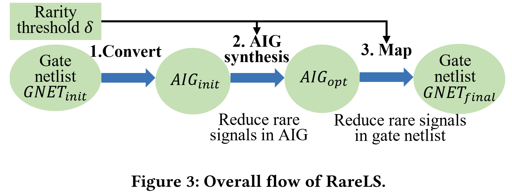

# RareLS
RareLS: Rarity-Reducing Logic Synthesis for Mitigating Hardware Trojan Threats

RareLS is used to reduce the number of rare signals in logic circuit to protect the circuit from hardware trojan attacks.
RareLS makes it harder for attackers to insert hardware trojans and makes it easier for defenders to detect hardware trojans.
RareLS's overall flow is shown below:


For more details, you can refer to the following paper:
[Chang Meng, Mingfei Yu, Hanyu Wang, Wayne Burleson, and Giovanni De Micheli, "*RareLS: Rarity-Reducing Logic Synthesis for Mitigating Hardware Trojan Threats*," in International Conference on Computer-Aided Design (ICCAD), New Jersay, USA, 2024.](paper/ICCAD_2024_RareLS__Rare_Reducing_Logic_Synthesis_for_Mitigating_Hardware_Trojan_Threats.pdf)


## Dependencies 

- Reference environment, **Ubuntu 20.04 LTS** with the following tools and libraries:

  - Tools: gcc 10.3.0 & g++ 10.3.0 & [cmake](https://cmake.org/) 3.16.3

    You can install these tools with the following command:

    ```shell
    sudo apt install gcc-10
    sudo apt install g++-10
    sudo apt install cmake
    ```

    You also need to check whether the default versions of gcc and g++ are 10.3.0:

    ```shell
    gcc --version
    g++ --version
    ```

    If the default versions of gcc and g++ are not 10.3.0, please change them to 10.3.0.

  - Libraries: [libboost](https://www.boost.org/) 1.74.0, libreadline 8.0-4, libgmp, libmpfr, libmpc

    You can install these libraries with the following command:

    ```shell
    sudo apt install libboost1.74-all-dev
    sudo apt install libreadline-dev
    sudo apt install libgmp-dev
    sudo apt-get install libmpfr-dev
    sudo apt-get install libmpc-dev

## Download

RareLS contains a submodule: open-source logic synthesis and verification tool abc

```shell
git clone --recursive https://github.com/changmg/RareLS.git
```

Please do add the argument "--recursive" to ensure that the submodule abc is cloned.

## Build

- To build, go to the root directory of the project, and then execute:

```shell
mkdir build
cd build
cmake -DCMAKE_BUILD_TYPE=Release ..
make
cd ..
```

If you compile successfully, you will obtain the following two executable programs:

1. rarels_aig_synthesis, performing rarity reducing AIG synthesis
2. rarels_map, performing rarity reducing technology mapping

## Execute

Examples

To perform step 2, rarity-reducing AIG synthesis, an example command is:

```shell
./rarels_aig_synthesis input/benchmark/abc-optimized/c0880_init.aig 0.1
```
where c0880 is the initial AIG file (converted from the optimized initial gate-netlist),
and 0.1 is the rarity threshold.
This command takes c0880_init.aig as the input AIG, reduce the number of rare signals in the AIG.
The rarity-reduced AIG will be saved into ./tmp/c0880_rarity_reduced_aig.blif


To perform step 3, rarity-reducing technology mapping, an example command is: 
```shell
./rarels_map --rareSignalThreshold 0.1 --inputBlif ./tmp/c0880_rarity_reduced_aig.blif
```
This command takes the rarity-reducing AIG ./tmp/c0880_rarity_reduced_aig.blif as input (from step 2),
and then performs rarity-reducing technology mapping.

## Explanation of the code for rarity-reducing mapping
The main function call is "RareMap(configurations)":
https://github.com/changmg/RareLS/blob/master/rarels-map/src/main.cc#L79
where "configurations" define some options such as the signal probability threshold and simulation frame.

In "RareMap(configurations)", there is a key class "RareMapMan" and "rareMapMan.Run()" is the entry of rarity-reducing mapping:
https://github.com/changmg/RareLS/blob/master/rarels-map/src/main.cc#L29

In "RareMapMan::Run()", it first computes the signal probabilities:
https://github.com/changmg/RareLS/blob/master/rarels-map/src/raremap.cc#L45
Then, it collects rare signals (please see the definition in the paper):
https://github.com/changmg/RareLS/blob/master/rarels-map/src/raremap.cc#L46
Using the rare signals, the rarity-reducing algorithm that also considers area optimization is performed by "Security_Amap(htResistantMapNet)":
https://github.com/changmg/RareLS/blob/master/rarels-map/src/raremap.cc#L63

Here, the implementation of "Security_Amap" refers to the "amap" command in the open-source logic synthesis tool ABC.
The key idea is add a penalty to the "effective area" for a cut with inherently rare signals.
Please refer to Section 3.2.2 and Eq. (1) in the paper.

Specifically, in "Security_Amap" transforms the circuit into AIG if the given circuit is not in AIG:
https://github.com/changmg/RareLS/blob/master/rarels-map/src/raremap.cc#L1153
And then calls "Security_NtkDarAmap" to map the AIG into standard cells:
https://github.com/changmg/RareLS/blob/master/rarels-map/src/raremap.cc#L1168

After a series of function calls, "Security_NtkDarAmap" -> "Security_Amap_ManTest" -> "Security_Amap_ManMap" -> "Security_Amap_ManMatch" -> "Security_Amap_ManMatchNode( Amap_Man_t * p, Amap_Obj_t * pNode, int fFlow, int fRefs )", 
we have the core mapping code "Security_Amap_ManMatchNode" for the node "pNode":
https://github.com/changmg/RareLS/blob/master/rarels-map/src/raremap.cc#L1570

In "Security_Amap_ManMatchNode", 
it first updates the "effective area" of pNode using "Security_Amap_CutAreaDeref"
https://github.com/changmg/RareLS/blob/master/rarels-map/src/raremap.cc#L1585
Then, it enumerates all possible cuts for pNode:
https://github.com/changmg/RareLS/blob/master/rarels-map/src/raremap.cc#L1591
and records the best gate in the standard cell library:
https://github.com/changmg/RareLS/blob/master/rarels-map/src/raremap.cc#L1603

"Security_Amap_CutAreaDeref" is function where Eq. (1) in the paper is implemented.
Here, it compares the signal switching activity with a threshold.
Switching activity (node V) = Prob(V=1) * Prob(V=0).
If a signal's switching activity is less than the threshold,
then the signal is a rare signal, so we add a panelty "LARGE" to the "effective area":
https://github.com/changmg/RareLS/blob/master/rarels-map/src/raremap.cc#L1388

